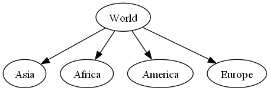

LittleTree is a library that provides a tree data structure to python.
The package is purely written in python.
It should be easy to use while efficient.

## Installing ##

- Use [pip](https://pip.pypa.io/en/stable/getting-started/) to install littletree:

```sh
$ pip install --upgrade littletree
```
## Usage ##

A tree can be used in a similar way as a `dict`:

```python
from littletree import Node

tree = Node(identifier="World")
tree["Asia"] = Node()
tree["Africa"] = Node()
tree["America"] = Node()
tree["Europe"] = Node()

tree.show()  # Same as print(tree.to_string())
tree.to_image().show()  # Show as an image instead
```

The resulting tree is printed like this:

```
World
├─ Asia
├─ Africa
├─ America
└─ Europe
```

And it creates the following image:



See [tutorial](https://github.com/lverweijen/littletree/blob/main/tutorial.md) for more information.


## Limitations ##
- Each node has a single parent
- A node can't have a sibling with the same identifier

## Alternatives ##

Before creating this, I looked at some other tree libraries.
I found the others to be lacking, because they were either slow or made simple things complicated.
Therefore, I decided to make my own.

- [anytree](https://github.com/c0fec0de/anytree) - Very hackable, but generally slow.
- [bigtree](https://github.com/kayjan/bigtree) - Similar to anytree, but has more features.
- [itertree](https://github.com/BR1py/itertree) - Has many features and good performance, but has a complicated design.
- [treelib](https://github.com/caesar0301/treelib) - This puts all nodes of a tree into a single dict. This makes some operations difficult or slow, although it has advantages too.
- [networkx](https://networkx.org/) - Is actually made for graphing. Doesn't have a dedicated tree type.
