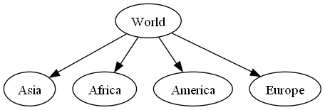

LittleTree is a library that provides a tree data structure to python,
which is both fast and flexible.
It can be used to represent file systems, taxonomies and much more.

## Features ##

- Intuitive basic creation and modification of trees.
- Efficient implementation of common tree operations and traversals
  that still work on trees that are more than 10,000 layers deep.
- Extensible: either subclass from `Node` or `BaseNode`.
- Can be imported / exported to many different formats (nested dict, rows, relations, graphviz, mermaid, newick, networkx).
- Purely written in Python.

## Limitation ##
- Each node has at most one parent. (It's a tree not a graph!)

## Installing ##

- Use [pip](https://pip.pypa.io/en/stable/getting-started/) to install littletree:

```sh
$ pip install --upgrade littletree
```
## Usage ##

A tree can be used in a similar way as a `dict`:

```python
from littletree import Node

tree = Node(identifier="World")
tree["Asia"] = Node()
tree["Africa"] = Node(data={"surface_area": 30.37e6})
tree["America"] = Node()

# Alternative way of adding a node
tree.add_child(Node(identifier="Europe"))

# Print tree to console
tree.show()

# Show tree as an image
tree.to_pillow().show()
```

The resulting tree is printed like this:

```
World
├─ Asia
├─ Africa
├─ America
└─ Europe
```

If [Pillow](https://pypi.org/project/pillow/) and [graphviz](https://graphviz.org/) are installed,
it will also display the following image:



See [tutorial](https://lverweijen.github.io/littletree/tutorial.html) for more information.

See further:
[Pypi](https://pypi.org/project/littletree/) |
[Github](https://github.com/lverweijen/littletree) |
[Issues](https://github.com/lverweijen/littletree/issues) |
[Documentation](https://lverweijen.github.io/littletree)
