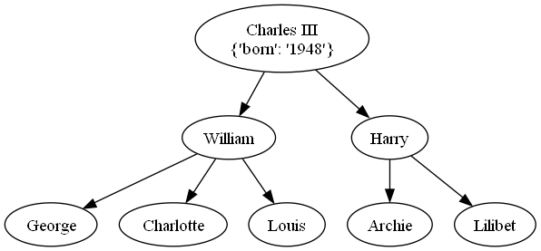

# Tutorial

First let's create the root of the tree:

```python
from littletree import Node

tree = Node({"population": 7.909}, identifier="World")
```

The tree is represented by a node.
All nodes have the following attributes:

| Attribute    | Use                                                 |
|--------------|-----------------------------------------------------|
| `identifier` | Indentifier of this node. Unique amongst siblings.  |
| `parent`     | Node which is the parent. For root, this is `None`. |
| `children`   | Nodes that are children.                            |
| `data`       | Dictionary in which data can be stored.             |

## Adding nodes

Adding nodes can be done as follows:

```python
tree["Asia"] = Node({"population": 4.694})
tree["Africa"] = Node({"population": 1.393})
```

Children and / or parent can be supplied in the constructor:

```python
# Create with nodes added to self
tree = Node({"population": 7.909}, identifier="World",
            children={
                "Asia": Node({"population": 4.694}),
                "Africa": Node({"population": 1.393})
            })

# Create with self added to parent
Node({"population": 1.029}, identifier="America", parent=tree)
```

It's not possible to add the same node to multiple parents:

```python
tree1 = Node()
tree2 = Node()
child = Node()

tree1["child"] = child  # Okay
tree2["child"] = child  # !DuplicateParentError!
```

Instead, you can either detach or copy the child:

```python
tree2["child"] = child.detach()  # Child is moved
tree2["child"] = child.copy()  # Child is copied
```

It's not possible to have two children by the same name:

```python
tree = Node()
child1 = Node(identifier="name", parent=tree)
child2 = Node(identifier="name", parent=tree)  # DuplicateChildError
child2 = Node(identifier="different_name", parent=tree)  # okay
```

It's not possible to become your own parent, grandparent or have a loop in the tree:

```python
tree = Node()
tree["child"] = tree  # LoopError
```

## Bulk adding

To add multiple children at once to a tree, `update` can be used.
It can be feed either a dictonary, an iterable of nodes or another node whose children will be added to ours.

```python
tree.update({
    "Asia": Node({"population": 4.694}),
    "Africa": Node({"population": 1.393}),
})
```

The method can also automatically detach or copy nodes from other, by setting mode:

```python
tree1 = Node(identifier="tree1")
tree2 = Node(identifier="tree2")

tree1["Asia"] = Node({"population": 4.694}),

# Node is copied from tree 1 to tree 2
tree2.update([tree1["Asia"]], mode="copy")

# Node is moved over from tree 1 to tree 2. It's no longer part of tree 1.
tree2.update([tree1["Asia"]], mode="detach")
```

## Iterators

There are a few functions for iteration.
They all return iterators but can be converted to list using `list`.

| Iterator                    | Function                            |
|-----------------------------|-------------------------------------|
| iter(tree.children)         | Iterate over children               |
| iter(tree.path)             | Iterate from root to self           |
| iter(tree.nodes)            | Iterate over all nodes              |
| iter(tree.ancestors)        | Iterate over ancestors              |
| iter(tree.descendants)      | Iterate over descendants            |
| iter(tree.siblings)         | Iterate over nodes with same parent |
| tree.iter_together(tree2)   | Iterate over multiple trees         |
| iter(node1.to(node2).nodes) | Iterate from one node to another    |

To iterate through the nodes in a specific order, use one of the following:

- `for node, item in tree.nodes.preorder()`
- `for node, item in tree.nodes.postorder()`
- `for node, item in tree.nodes.levelorder()`

These three iterators also works on `tree.descendants`.
These iterators accept an optional argument `keep`.
If passed, a node and its descendants will be skipped `if not keep(node, item)`.
Argument `item` is a NamedTuple of `depth` and `index`.
Use `keep=MaxDepth(n)` to iterate at most `n` levels deep.

## Path operations

When you are lost, you can find the path of a node using

```python
str(tree["Europe"].path)  # => "/World/Europe"
```

Path can also be used to find nodes deeper down the hierarchy

```python
# Bracketed way
lisbon = tree["Europe"]["Portugal"]["Lisbon"])

# Using path
lisbon = tree.path(["Europe", "Portugal", "Lisbon"])
lisbon = tree.path("Europe/Portugal/Lisbon")
```

If `Lisbon` doesn't yet exist, it can be created:

```python
lisbon = tree.path.create(["Europe", "Portugal", "Lisbon"])
lisbon = tree.path.create("Europe/Portugal/Lisbon")
```

It can also be searched for:

```python
lisbon_nodes = tree.path.glob("**/Lisbon")
```

## Miscellaneous tree operations

Calculate height and breadth of a tree

```python
height = tree.levels.count() - 1
breadth = tree.leaves.count()
```

Find depth of a node:
```python
depth = node.ancestors.count()
```

Path from one node to another:
```python
madrid = tree.path.create("Europe/Spain/Madrid")
madrid_to_lisbon = list(madrid.to(lisbon).nodes)
# => [madrid, spain, europe, portugal, lisbon]
```

Number of edges between two nodes:
```python
distance = madrid.to(lisbon).edges.count()
```

Find lowest common ancestor of two nodes:
```python
europe = madrid.to(lisbon).lca
```

## Exporting and serialization

Nodes have basic import and exports options with many parameters:

| Format  | Function                                 | Use                                     |
|---------|------------------------------------------|-----------------------------------------|
| Text    | `to_string()`                            | Pretty print the tree                   |
| Text    | `to_dot()`, `to_mermaid()`, `to_latex()` | Exports to dot, mermaid, latex          |
| Image   | `to_image()`, `to_pillow()`              | Requires graphviz or mermaid            |
| Nested  | `from_dict()` / `to_dict()`              | Converting to / from json-like formats  |
| Rows    | `from_rows()` / `to_rows()`              | Converting to / from path lists         |
| Rows    | `from_relations()` / `to_relations()`    | Converting to / from parent-child lists |
| Text    | `from_newick()` / `to_newick()`          | Converting to / from newick-format      |
| DiGraph | `from_networkx()` / `to_networkx()`      | Converting to / from networkx-format    |

```python
family_newick = "((George, Charlotte, Louis)William,(Archie, Lilibet)Harry)'Charles III'[&&NHX:born=1948]"
family_tree = Node.from_newick(family_newick)
family_tree.show(style="round-arrow")  # Uses family_tree.to_string()
family_tree.to_pillow().show()  # Requires graphviz and Pillow
family_tree.plot()  # Requires matplotlib
```

```text
Charles III
{'born': '1948'}
├→ William
│  ├→ George
│  ├→ Charlotte
│  ╰→ Louis
╰→ Harry
   ├→ Archie
   ╰→ Lilibet
```


## Tricks

### Nodes by index

If in addition to accessing nodes by identifier, access based on index is needed,
[IndexedDict](https://pypi.org/project/indexed/) can be used.

```shell
pip install indexed
```

```python
import indexed

class IndexedNode(Node):
    __slots__ = ()
    dict_class = indexed.Dict


tree = IndexedNode()
tree["Asia"] = IndexedNode()

assert tree.children[0] == tree["Asia"]
```

### Always sorted children

Similarly, a node can be constructed where the children are always sorted by identifier.

```shell
pip install sortedcontainers
```
```python
from sortedcontainers import SortedDict

class SortedNode(Node):
    __slots__ = ()
    dict_class = SortedDict
    
    def sort_children(self):
        # This has now become a no-op
        pass
```

### Symlinks

It's possible to create nodes that share the same data, but have different parents or children.
Below it is shown how these nodes can be made aware of each other.

```python
class AliasNode(Node):
    __slots__ = "_aliases"
    def __init__(self, *args, **kwargs):
        super().__init__(*args, **kwargs)
        self._aliases = dict()
        
    def make_alias(self):
        new_alias = AliasNode(self.data)
        self._aliases[id(new_alias)] = new_alias
        new_alias._aliases = self._aliases
        return new_alias
    
    @property
    def aliases(self):
        return [alias for alias in self._aliases.values()
                if alias not is self]

node1 = AliasNode({'info': 5})
node2 = node1.make_alias()

node2.data["more_info"] = 6
print(node2.data['info'])  # => 5
print(node1.data['more_info'])  # => 6

print(node1.aliases)  # => [node2]
print(node2.aliases)  # => [node1]
```
