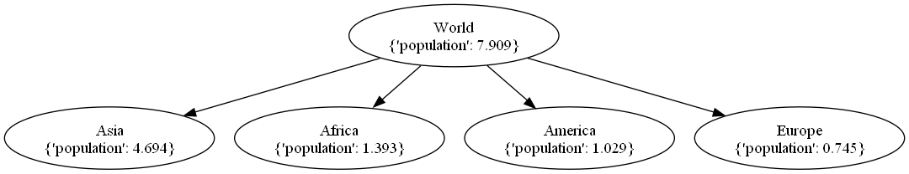

# Tutorial

First let's create the root of the tree:

```python
from littletree import Node

tree = Node({"population": 7.909}, identifier="World")
```

## Adding nodes

Adding nodes can be done as follows:

```python
tree["Asia"] = Node({"population": 4.694})
tree["Africa"] = Node({"population": 1.393})
```

You can also supply children or a parent in the constructor:

```python
# Create with nodes added to self
tree = Node({"population": 7.909}, identifier="World",
            children={
                "Asia": Node({"population": 4.694}),
                "Africa": Node({"population": 1.393})
            })

# Create with self added to parent
Node({"population": 1.029}, identifier="America", parent=tree)
```

It's not possible to add the same node to multiple parents:

```python
tree1 = Node()
tree2 = Node()
child = Node()

tree1["child"] = child  # Okay
tree2["child"] = child  # !DuplicateParentError!
```

Instead, you can either detach or copy the child:

```python
tree2["child"] = child.detach()  # Child is moved
tree2["child"] = child.copy()  # Child is copied
```

It's not possible to have two children by the same name:

```python
tree = Node()
child1 = Node(identifier="name", parent=tree)
child2 = Node(identifier="name", parent=tree)  # DuplicateChildError
child2 = Node(identifier="different_name", parent=tree)  # okay
```

It's not possible to become your own parent, grandparent or have a loop in the tree:

```python
tree = Node()
tree["child"] = tree  # LoopError
```

## Bulk adding

To add multiple children at once to a tree, `update` should be used.
It can be feed either a dictonary, an iterable of nodes or another node whose children will be added to ours.

```python
tree.update({
    "Asia": Node({"population": 4.694}),
    "Africa": Node({"population": 1.393}),
})
```

The method can also automatically detach or copy nodes from other, by setting mode:

```python
tree1 = Node(identifier="tree1")
tree2 = Node(identifier="tree2")

tree1["Asia"] = Node({"population": 4.694}),

# Node is copied from tree 1 to tree 2
tree2.update([tree1["Asia"]], mode="copy")

# Node is moved over from tree 1 to tree 2. It's no longer part of tree 1.
tree2.update([tree1["Asia"]], mode="detach")
```

## Iterators

There are a few functions for iteration.
They all return an iterator but can be converted to list using `list`.

| Iterator                | Function                            |
|-------------------------|-------------------------------------|
| iter(tree.children)     | Iterator over children              |
| iter(tree.path)         | Iterator from root to self          |
| tree.iter_tree()        | Iterate over all nodes              |
| tree.iter_ancestors()   | Iterate over ancestors              |
| tree.iter_descendants() | Iterate over descendants            |
| tree.iter_siblings()    | Iterate over nodes with same parent |

Some iterators can be controlled with parameters such as:
- `order` - In what order to iterate over nodes (default: `"pre"`)
- `with_item` - Whether to also yield an item with index and level of the iterated node (default: `False`)
- `keep` - Exclude this node and its descendants from iteration `if not keep(node)`

## Path operations

When you are lost, you can find the path of a node using

```python
str(tree["Europe"].path)  # => "/World/Europe"
```

Path can also be used to find nodes deeper down the hierarchy

```python
# Bracketed way
lisbon = tree["Europe"]["Portugal"]["Lisbon"])

# Using path
lisbon = tree.path(["Europe", "Portugal", "Lisbon"])
lisbon = tree.path("Europe/Portugal/Lisbon")
```

If `Lisbon` doesn't yet exist, it can be created:

```python
lisbon = tree.path.create(["Europe", "Portugal", "Lisbon"])
lisbon = tree.path.create("Europe/Portugal/Lisbon")
```

It can also be searched for:

```python
lisbon_nodes = tree.path.glob("**/Lisbon")
```

## Exporting and serialization

Nodes have a basic import and exports options with many parameters:

| Format | Function                | Use                                        |
|--------|-------------------------|--------------------------------------------|
| Text   | to_string()             | Pretty print the tree                      | 
| Image  | to_dot(), to_image()    | For exports to image (requires graphviz)   | 
| Nested | from_dict() / to_dict() | For converting to / from json-like formats |
| Rows   | from_rows() / to_rows() | For converting to / from csv-like formats  |

```python
tree = Node({"population": 7.909}, identifier="World")
tree["Asia"] = Node({"population": 4.694})
tree["Africa"] = Node({"population": 1.393})
tree["America"] = Node({"population": 1.029})
tree["Europe"] = Node({"population": 0.745})
tree.to_image('world_graph.png')  # Requires dot(graphviz) to be on path
```


